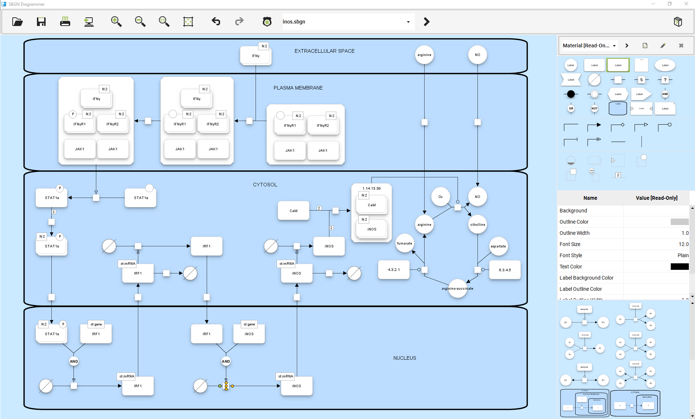
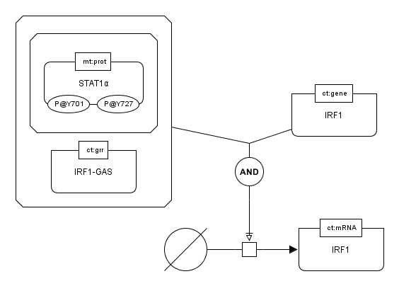
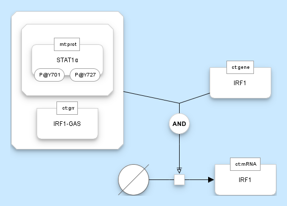
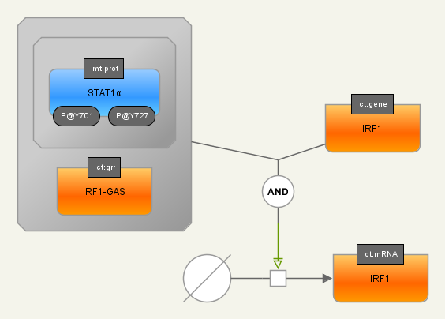
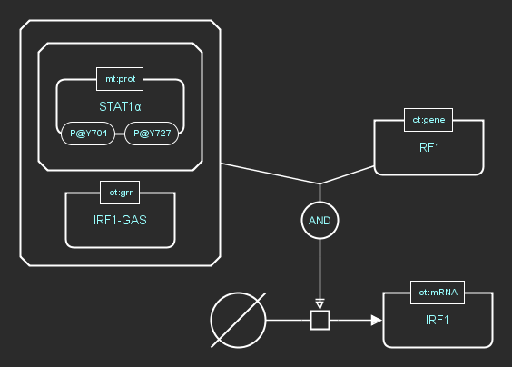

  

# Krayon for SBGN 

## Introduction

Krayon is a [yFiles](https://www.yworks.com/products/yfiles-for-java)-based editor for [SBGN](http://sbgn.github.io/sbgn/) diagrams that is written in [kotlin](https://kotlinlang.org/).

Features include
* Full feature set for [SBGN Process Description Language Level 1, v1.3](http://sbgn.github.io/sbgn/specifications)
* Loading and saving SBGN diagram in the standardized [SBGN-ML format](https://github.com/sbgn/sbgn/wiki/SBGN_ML).     
* Printing, and exporting diagrams to PNG, GIF, JPG, SVG, PDF, and EPS.
* Easy-to-apply predefined diagram styles 
* Easy-to-create custom styling
* Fully mouse-driven diagram creation
* Many keyboard-shortcuts for the power-users
* Easy-to-enter special characters (subscripts, superscripts, greek letters) 
* SBGN strict mode that helps you to create valid SBGN diagram quickly
* [SBGN bricks](http://sbgn.github.io/sbgn/sbgnbricks)
* Different UI Styles

### Predefined Diagram Styles

Default | Material
|:----------:|:-------:|
|

Colorful | Dark
|:----------:|:-------:|
|

### Available UI Styles
Material| Dark | System (OS default) 
:------:|:------:|:------:|
||

## Source Code Installations:

Setting up your IDEA project:krayon-icons.jar

1. Open as Project or as Project from Version Control
2. Set Java 8 as project SDK
3. Set project language level to 8
3. Set the compile output path to 'out' 
4. Copy yFiles for Java v3.1.x jar file to yfiles-lib-and-license/lib
5. Copy yFiles for Java license file to yfiles-lib-and-license/license
  
Testing your installation:

1. Navigate to krayon.editor.sbgn.KrayonForSbgn and run it with a Java 8 JRE. 
2. To run it with a Java 9 or 10 JRE provide the additional VM parameter --add-modules=java.xml.bind.

No Icons?

The source code does not include application icons. The binary application includes [IconExperience O-Collection](https://www.iconexperience.com/o_collection) icons, 
which are available under a commercial license.
  
## Binary Application Installations:

1. Go to the [release](https://github.com/wiese42/krayon4sbgn/releases) section of this project and fetch the latest version either as self-contained windows installer, or as zip file containing all necessary jar files to run the application. 
2. With the windows installer, simply follow the instructions, to install and run the application.
3. For the zipped jar distribution, you need to have a Java JRE 8, 9 or 10 installed. To run the software switch to the installation folder and execute on the command line:
  - **with Java 8**: java -jar kreator-for-sbgn.jar
  - **with Java 9 or 10**: java --add-modules=java.xml.bind -jar kreator-for-sbgn.jar
